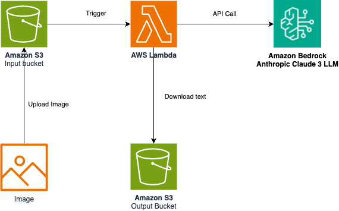

# Extrair conteúdo da imagem usando o Amazon Bedrock Claude v3 Sonnet LLM

Este projeto de exemplo usa o Amazon Bedrock Claude V3 sonnet LLM para interpretar uma imagem e salvar o resultado em um arquivo texto e carregar o resultado no bucket do Amazon S3.

Importante: Este aplicativo usa vários serviços da AWS e há custos associados a esses serviços após o uso do nível gratuito - consulte a [Pagina de preços da AWS](https://aws.amazon.com/pricing/) para obter detalhes. Você é responsável por quaisquer custos da AWS incorridos. Nenhuma garantia está implícita neste exemplo.

## Requisitos
- [Crie uma conta da AWS](https://portal.aws.amazon.com/gp/aws/developer/registration/index.htm) se você ainda não tiver uma e faça o login. O usuário IAM que você usar deve ter permissões suficientes para fazer as chamadas de serviço da AWS necessárias e gerenciar os recursos da AWS.
- [AWS CLI](https://docs.aws.amazon.com/cli/latest/userguide/install-cliv2.html) instalado e configurado
- [Git instalado](https://git-scm.com/book/en/v2/Getting-Started-Installing-Git)
- [AWS Serverless Application Model (AWS SAM)](https://docs.aws.amazon.com/serverless-application-model/latest/developerguide/serverless-sam-cli-install.html) instalado

## Pré-requisito
Os usuários do Amazon Bedrock precisam solicitar acesso aos modelos antes que eles estejam disponíveis para uso. Solicite acesso ao Claude V3 Sonnet LLM no console do Amazon Bedrock. Consulte o link abaixo para obter instruções: [Acesso ao modelo](https://docs.aws.amazon.com/bedrock/latest/userguide/model-access.html).

## Instruções de implantação

1. Crie um novo diretório, navegue até esse diretório em um terminal e clone o repositório do GitHub:
   ```bash
   git clone https://github.com/mpenhalver/llm-image-to-text.git
   ```

2. Mude de diretório para o diretório do padrão:
   ```bash
   cd llm-image-to-text
   ```

3. Na linha de comando, use o AWS SAM para implantar os recursos da AWS para o padrão, conforme especificado no arquivo template.yml:
   ```bash
   sam deploy -g
   ```

4. Durante os prompts:

   - Digite um nome de stack.
   - Digite a região da AWS desejada.
   - Deixe as outras opções como padrão.

   Depois de executar o modo `sam deploy --guided` uma vez e salvar os argumentos em um arquivo de configuração (samconfig.toml), você pode usar `sam deploy` no futuro para usar esses padrões.

5. A configuração está pronta para teste.

## Como funciona

Consulte o diagrama de arquitetura abaixo:


* O usuário carrega um arquivo de imagem no bucket de input do Amazon S3.
* O Amazon S3 aciona a função AWS Lambda quando um novo objeto é carregado no bucket de entrada do S3.
* A função AWS Lambda lê o arquivo de imagem, converte-o no formato codificado em Base 64 e chama a API do Amazon Bedrock para o Anthropic Claude V3 Sonnect LLM com os dados codificados e o prompt para um texto a partir dele.
* A API Amazon Amazon Bedrock para Anthropic Claude V3 Sonnect LLM extrai o conteúdo e retorna a resposta JSON.
* A função AWS Lambda cria um arquivo de texto com o conteúdo e o salva no bucket de saída do Amazon S3.

## Testando


1. Na linha de comando, execute o comando abaixo para carregar o arquivo `image1.jpeg` no bucket do Amazon S3. Substitua `MyInputBucketName` da saída `sam deploy` e também sua região.
   ```bash
   aws s3 cp image1.jpeg s3://{MyInputBucketName}/image1.jpeg --region {sua-regiao}
   ```

2. Faça login no [Console do Amazon S3](https://s3.console.aws.amazon.com/s3/buckets), em alguns segundos, você deve ver um arquivo `claude_output.txt` carregado no bucket S3 `MyOutputBucketName`. Baixe o arquivo do bucket usando o comando abaixo e valide o conteúdo.
   ```bash
   aws s3 cp s3://{MyOutputBucketName}/claude_output.txt ./claude_output.txt --region {sua-regiao}
   ```
